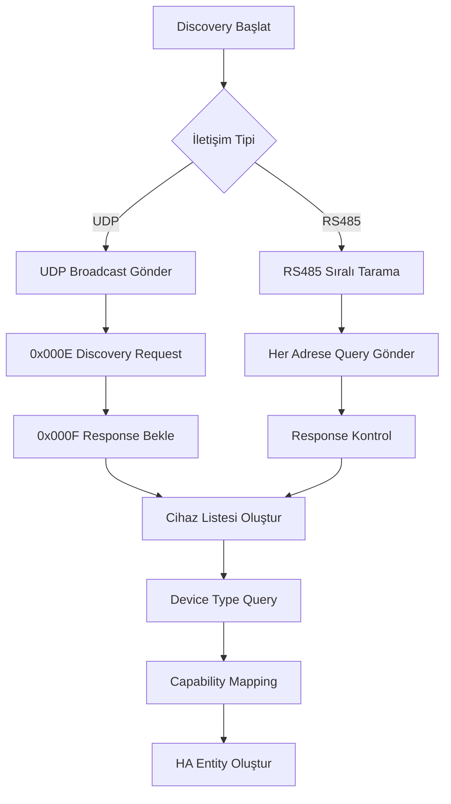
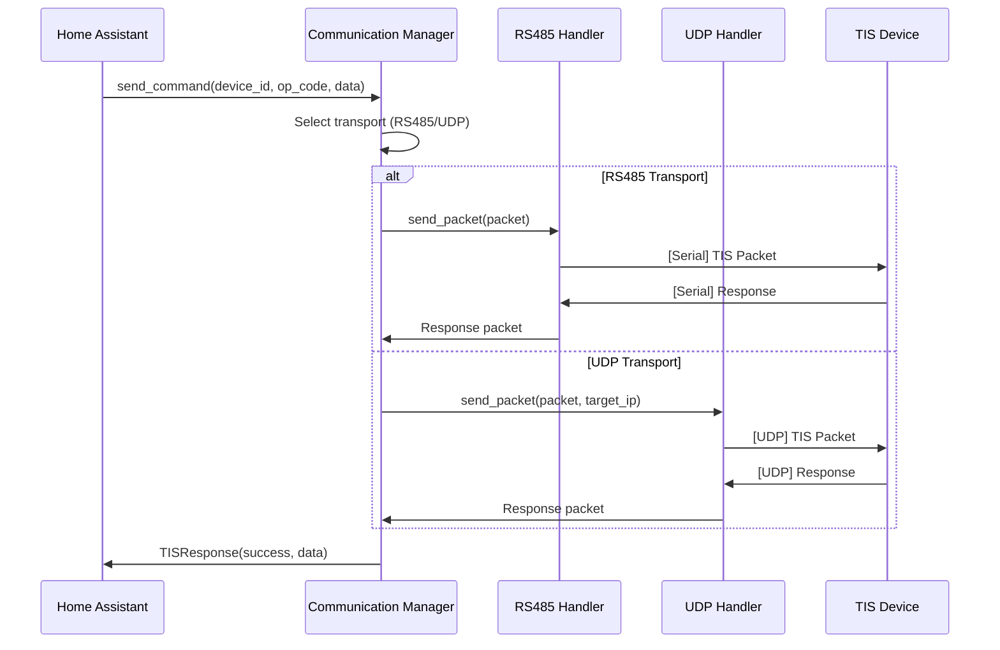

# TIS Discovery ve Communication Layer Detaylı Tasarım

## 🔍 Discovery Sistem Mimarisi

### Device Discovery Service

#### TISDeviceDiscovery Class
```python
class TISDeviceDiscovery:
    """Otomatik cihaz keşif servisi"""
    
    def __init__(self, communication_manager):
        self.comm_manager = communication_manager
        self.discovered_devices = {}
        self.device_capabilities = {}
        self.discovery_active = False
        
    async def start_discovery(self, timeout: int = 30) -> List[TISDevice]:
        """Ana discovery fonksiyonu"""
        
    async def scan_network_udp(self) -> List[TISDevice]:
        """UDP broadcast ile ağ tarama"""
        
    async def scan_rs485_range(self, subnet: int = 1, start: int = 1, end: int = 254) -> List[TISDevice]:
        """RS485 üzerinden sıralı cihaz tarama"""
        
    async def identify_device_type(self, device_id: str) -> DeviceType:
        """Cihaz tipini belirleme"""
        
    async def query_device_capabilities(self, device: TISDevice) -> DeviceCapabilities:
        """Cihazın yeteneklerini sorgulama"""
```

#### Discovery Süreci


#### Device Discovery OpCodes
```python
DISCOVERY_OPCODES = {
    # Primary Discovery
    0x000E: "Discovery Request",
    0x000F: "Discovery Response (Device Name)",
    
    # Device Information
    0x0031: "Device Info Request", 
    0x0032: "Device Info Response",
    0xEFFD: "Firmware Version Query",
    0xEFFE: "Firmware Version Response",
    0xF003: "MAC Address Query",
    0xF004: "MAC Address Response",
    
    # Status Queries
    0x0280: "Manual Programming Status Query",
    0x0281: "Manual Programming Status Response",
    0x0033: "Device Update Request",
    0x0034: "Device Update Response",
}
```

### Device Capability Mapping

#### TISDeviceCapabilities Class
```python
@dataclass
class TISDeviceCapabilities:
    device_type: int
    model_name: str
    supported_entities: List[str]  # ["switch", "light", "sensor"]
    channels: int
    features: Dict[str, Any]
    opcodes: Dict[str, int]  # Feature -> OpCode mapping
    
class DeviceCapabilityMapper:
    """Cihaz tiplerini Home Assistant entity'lerine eşler"""
    
    DEVICE_MAPPINGS = {
        # Lighting Devices
        0x0001: {  # Single Channel Lighting
            "entities": ["light"],
            "channels": 1,
            "features": {
                "brightness": True,
                "on_off": True,
                "dimmer": True
            },
            "opcodes": {
                "control": 0x0031,
                "status": 0x0032,
                "update": 0x0033
            }
        },
        
        # Climate Control
        0x806C: {  # TIS-MER-AC4G-PB
            "entities": ["climate", "sensor"],
            "channels": 4,
            "features": {
                "temperature": True,
                "fan_speed": True,
                "hvac_modes": ["cool", "heat", "auto", "off"],
                "current_temperature": True
            },
            "opcodes": {
                "ac_control": 0xA12E,
                "ac_status": 0xA12F,
                "temp_query": 0xE0F8,
                "temp_response": 0xE0F9
            }
        },
        
        # Sensors
        0x8022: {  # TIS-HEALTH-CM
            "entities": ["sensor"],
            "channels": 1,
            "features": {
                "temperature": True,
                "humidity": True,
                "co2": True,
                "tvoc": True,
                "noise": True,
                "lux": True
            },
            "opcodes": {
                "sensor_query": 0x2024,
                "sensor_response": 0x2025
            }
        },
        
        # Universal Switches
        0x0051: {  # Universal Switch Type 1
            "entities": ["switch"],
            "channels": 1,
            "features": {
                "on_off": True,
                "room_control": True
            },
            "opcodes": {
                "control": 0x0031,
                "status": 0x0032
            }
        }
    }
    
    async def get_capabilities(self, device_type: int) -> TISDeviceCapabilities:
        """Device type'tan capability döndür"""
```

## 📡 Communication Layer Mimarisi

### TISCommunicationManager
```python
class TISCommunicationManager:
    """Ana iletişim yöneticisi - RS485 ve UDP'yi yönetir"""
    
    def __init__(self, config: TISConfig):
        self.config = config
        self.rs485_handler = None
        self.udp_handler = None
        self.active_connections = {}
        self.command_queue = asyncio.Queue()
        self.response_handlers = {}
        
    async def initialize(self) -> bool:
        """İletişim katmanını başlat"""
        
    async def send_command(self, device_id: str, op_code: int, data: bytes = b'') -> TISResponse:
        """Cihaza komut gönder"""
        
    async def query_device(self, device_id: str, query_type: str) -> Dict[str, Any]:
        """Cihazdan bilgi sorgula"""
        
    async def start_monitoring(self) -> None:
        """Cihaz durumu izlemeyi başlat"""
```

### RS485 Handler
```python
class TISRS485Handler:
    """RS485 seri iletişim yöneticisi"""
    
    def __init__(self, port: str, baudrate: int = 9600, parity: str = "EVEN"):
        self.port = port
        self.baudrate = baudrate
        self.parity = parity
        self.serial_connection = None
        self.read_task = None
        self.packet_buffer = bytearray()
        
    async def connect(self) -> bool:
        """Seri porta bağlan"""
        
    async def disconnect(self) -> None:
        """Bağlantıyı kapat"""
        
    async def send_packet(self, packet: bytes) -> bool:
        """Paket gönder"""
        
    async def read_packets(self) -> None:
        """Gelen paketleri sürekli oku"""
        
    def parse_packet(self, data: bytes) -> Optional[TISPacket]:
        """TIS paketini parse et"""
```

### UDP Handler
```python
class TISUDPHandler:
    """UDP network iletişim yöneticisi"""
    
    def __init__(self, interface: str = "0.0.0.0", port: int = 6000):
        self.interface = interface
        self.port = port
        self.socket = None
        self.broadcast_socket = None
        self.read_task = None
        
    async def start_listening(self) -> bool:
        """UDP dinlemeyi başlat"""
        
    async def stop_listening(self) -> None:
        """UDP dinlemeyi durdur"""
        
    async def send_packet(self, packet: bytes, target: str = "255.255.255.255") -> bool:
        """UDP paketi gönder"""
        
    async def send_broadcast(self, packet: bytes) -> bool:
        """Broadcast paket gönder"""
        
    async def handle_incoming_packets(self) -> None:
        """Gelen paketleri işle"""
```

### Protocol Abstraction Layer
```python
class TISProtocolHandler:
    """TIS protokol soyutlama katmanı"""
    
    @staticmethod
    def build_packet(
        operation_code: int,
        source_device: Tuple[int, int],
        target_device: Tuple[int, int],
        device_type: int = 0xFFFE,
        additional_data: bytes = b'',
        transport: str = "udp"
    ) -> bytes:
        """TIS paketi oluştur"""
        
    @staticmethod
    def parse_packet(packet: bytes) -> TISPacket:
        """TIS paketini parse et"""
        
    @staticmethod
    def calculate_crc(data: bytes) -> int:
        """CRC hesapla"""
        
    @staticmethod
    def validate_crc(packet: bytes) -> bool:
        """CRC doğrula"""
```

### Packet Data Structures
```python
@dataclass
class TISPacket:
    """TIS packet veri yapısı"""
    source_ip: str
    header: str  # "SMARTCLOUD"
    length: int
    source_device: Tuple[int, int]  # (subnet, device)
    device_type: int
    op_code: int
    target_device: Tuple[int, int]
    additional_data: bytes
    crc: int
    crc_valid: bool
    timestamp: datetime
    transport: str  # "rs485" or "udp"

@dataclass
class TISDevice:
    """TIS cihaz bilgisi"""
    device_id: str  # "1.68"
    device_type: int  # 0x806C
    model_name: str  # "TIS-MER-AC4G-PB"
    ip_address: str
    firmware_version: str
    mac_address: str
    capabilities: TISDeviceCapabilities
    last_seen: datetime
    transport: str

@dataclass
class TISResponse:
    """TIS komut yanıtı"""
    success: bool
    op_code: int
    data: bytes
    error_message: str
    response_time: float
```

## 🔄 Communication Flow

### Command Execution Flow


### Error Handling Strategy
```python
class TISErrorHandler:
    """TIS protokol hata yönetimi"""
    
    ERROR_CODES = {
        "TIMEOUT": "Command timeout",
        "CRC_ERROR": "CRC validation failed", 
        "DEVICE_NOT_FOUND": "Device not responding",
        "INVALID_OPCODE": "Unsupported operation",
        "COMM_ERROR": "Communication failure"
    }
    
    async def handle_error(self, error_type: str, context: dict) -> TISResponse:
        """Hata durumunu yönet"""
        
    async def retry_command(self, command: TISCommand, max_retries: int = 3) -> TISResponse:
        """Komut tekrar deneme"""
```

## 🎯 Implementation Priority

### Aşama 1: Core Communication (1 hafta)
- [ ] TISProtocolHandler temel fonksiyonlar
- [ ] UDP Handler basic send/receive
- [ ] Packet parsing ve CRC validation
- [ ] Error handling mekanizması

### Aşama 2: Discovery Implementation (1 hafta)
- [ ] UDP broadcast discovery
- [ ] Device type identification
- [ ] Capability mapping database
- [ ] Auto device registration

### Aşama 3: RS485 Support (1 hafta)
- [ ] Serial port async handler
- [ ] RS485 packet format adaptation
- [ ] Dual transport support
- [ ] Connection management

### Aşama 4: Advanced Features (1 hafta)
- [ ] Command queuing
- [ ] State monitoring
- [ ] Connection pooling
- [ ] Performance optimization

## 🧪 Test Framework

### Unit Tests
```python
class TestTISCommunication:
    async def test_udp_discovery(self):
        """UDP discovery testi"""
        
    async def test_packet_parsing(self):
        """Paket parse testi"""
        
    async def test_command_execution(self):
        """Komut gönderme testi"""
        
    async def test_error_handling(self):
        """Hata yönetimi testi"""
```

### Integration Tests
- Simülatör ile full system test
- Gerçek cihazlar ile validation
- Performance benchmarking
- Stress testing

Bu tasarım, TIS protokol analizi sonuçlarını temel alarak esnek, ölçeklenebilir ve güvenilir bir communication layer sağlar. Home Assistant async architecture'ı ile uyumludur.